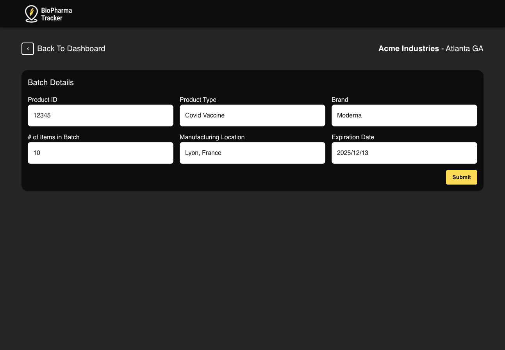
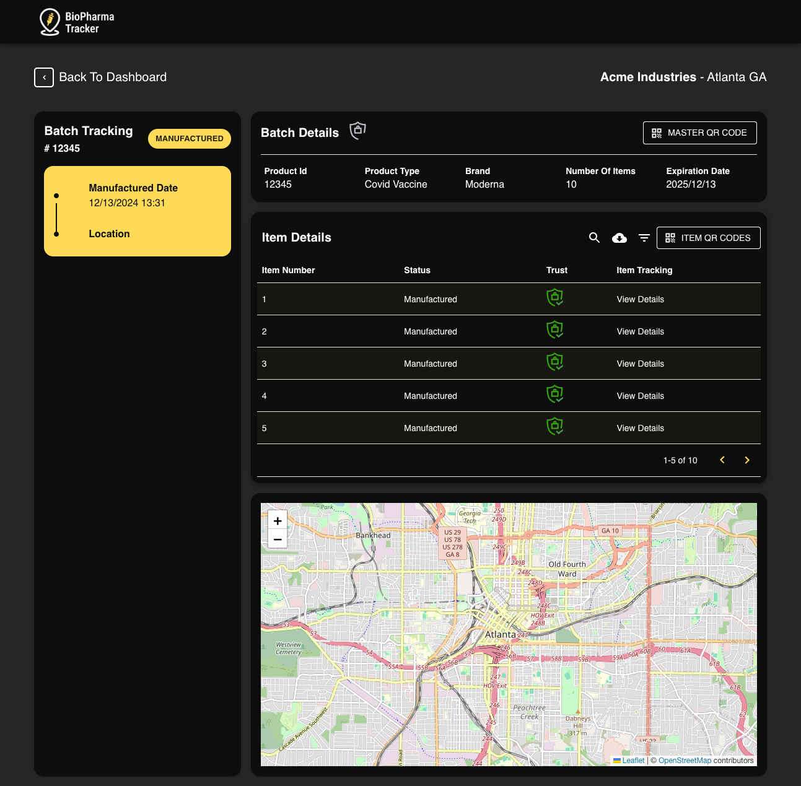
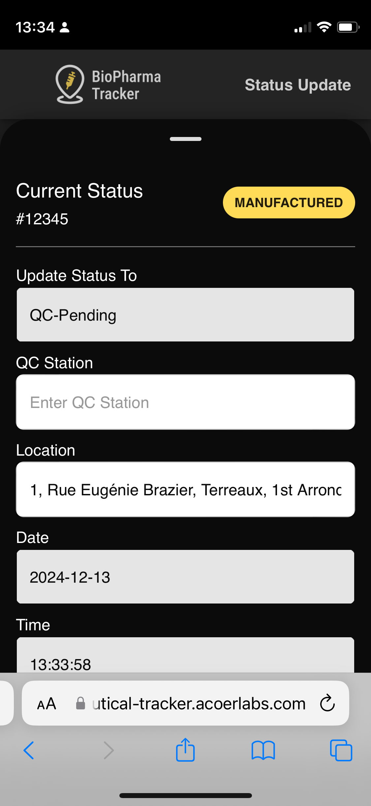
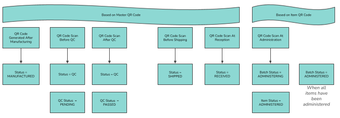
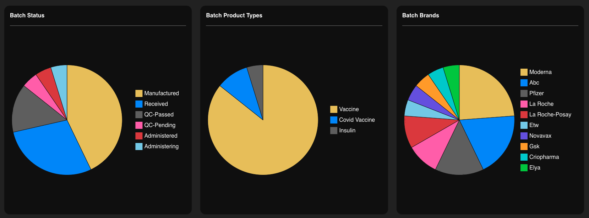
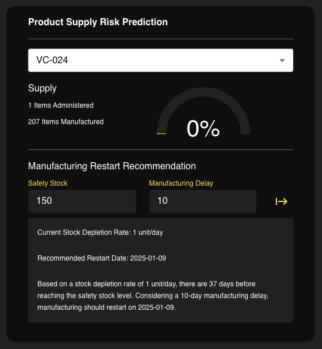
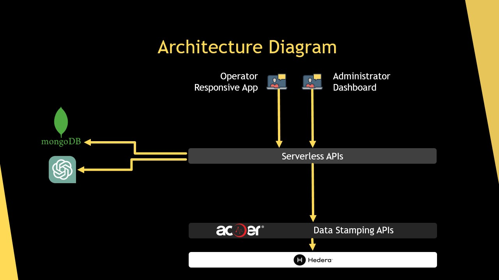

# Hello Future 2.0 Hackathon 2024 Submission

## Project Name: *Biopharma Tracker*

### Table of Contents
1. [Project Overview](#project-overview)
2. [Features](#features)
3. [Tech Stack](#tech-stack)
4. [Development Steps](#development-steps)
5. [Usage](#usage)
6. [Demo](#demo)
7. [Architecture](#architecture)
8. [Challenges Faced](#challenges-faced)
9. [Future Improvements](#future-improvements)
10. [Why This Project Should Win?](#why-this-project-should-win)
11. [Contributors](#contributors)
12. [License](#license)

---

## Project Overview

BioPharma Tracker is a cutting-edge solution designed to enhance traceability, security, and efficiency within the biopharmaceutical supply chain. Leveraging Hedera Distributed Ledger Technology (DLT), our system ensures that every step of a product's lifecycle is securely and immutably recorded, providing complete transparency for all stakeholders.

Our platform utilizes dynamic Master and Child QR codes to enable real-time tracking of biopharmaceutical products from manufacturing to administration. Administrators can generate detailed QR codes for entire batches and individual items, while operators can seamlessly update statuses at each critical stage using intuitive mobile interfaces.

In addition to robust tracking capabilities, BioPharma Tracker features an AI-powered demand prediction tool. This advanced functionality analyzes stock levels, safety thresholds, and manufacturing delays to provide actionable insights, helping organizations make informed decisions about production schedules and inventory management.

By integrating Hedera's high-throughput, secure, and scalable DLT, BioPharma Tracker offers a reliable and transparent solution to combat challenges in the biopharmaceutical supply chain. Our system not only prevents counterfeiting and reduces errors but also ensures that patients consistently receive the medications they need without disruptions.

## Features

- **Dynamic QR Code Generation**: Create Master QR codes for entire batches and unique Child QR codes for individual items, enabling precise tracking throughout the supply chain.
- **Real-Time Product Tracking**: Monitor the movement of biopharmaceutical products from manufacturing to administration with up-to-the-minute updates.
- **Immutable Ledger with Hedera DLT**: Utilize Hedera's Distributed Ledger Technology to ensure all records are secure, tamper-proof, and permanently recorded.
- **User-Friendly Dashboards**: Access comprehensive dashboards that provide administrators with an overview of active batches, detailed tracking information, and actionable insights.
- **AI-Powered Demand Prediction**: Leverage artificial intelligence to forecast demand, optimize inventory management, and prevent stock shortages by analyzing real-time supply data.
- **Geolocation Tracking**: Incorporate geolocation data to visualize the exact location of products at each stage of the supply chain, enhancing transparency and accountability.
- **Status Updates at Critical Stages**: Enable operators to update the status of batches and individual items at key points such as manufacturing, quality control, shipping, and administration.
- **Authentication and Counterfeit Prevention**: Ensure product authenticity by verifying QR codes, thereby reducing the risk of counterfeit biopharmaceuticals entering the supply chain.
- **Comprehensive Data Analytics**: Access detailed analytics and reports on supply chain performance, identifying bottlenecks and opportunities for improvement.
- **Scalable and Secure Infrastructure**: Benefit from Hedera's high-throughput and secure infrastructure, capable of handling large volumes of transactions with minimal latency.

## Tech Stack

- **Frontend:**: HTML, CSS, React
- **Backend:** Lambda functions implemented in Node.js
- **Database:** MongoDB Serverless
- **Other Technologies:** ACOER Data Stamping solutions for every interaction with the Hedera network

## Development steps

### QR Code

We began by designing a robust QR code system that enables tracking at both the batch level and the individual item level. This dual-tiered approach allows us to monitor the entire supply chain of biopharmaceutical products while managing the available stock of each pharmaceutical item with precision.

To enhance automation, we established dependencies between these two types of QR codes. For example, when all individual items within a batch are administered, the system automatically updates the batch status to "Administered." This seamless transition facilitates fully automated workflows, ensuring efficiency and accuracy throughout the supply chain process.

### Serverless APIs

We chose to implement all of our APIs using the Serverless framework, taking advantage of its scalability and efficient deployment capabilities. Our API suite includes the **Batches API**, which allows users to list batches, create new batches along with their associated batch items, retrieve specific batch details, view batch activities, access batch QR codes, and obtain trust details for each batch. Additionally, the **Batch Items API** provides functionalities to list individual batch items, retrieve specific item details and activities, access QR codes for batch items, and obtain trust details for each item.

Furthermore, we developed the **Webhook API**, a notification system integrated with the ACOER Data Stamping product that functions as a webhook, triggering notifications whenever data is fully submitted to the Hedera ledger. Our **AI API** encompasses prediction capabilities through the Prediction API and allows retrieval of prediction trust details. All of these APIs are deployed as Lambda functions within the Serverless framework, ensuring a robust, scalable, and maintainable infrastructure for our BioPharma Tracker system.

### AI Integration

In our previous project, we leveraged [H2O.ai](https://h2o.ai/) for our AI and machine learning needs, which provided robust tools for data analysis and predictive modeling. However, for this hackathon, we have chosen to adopt the **o1-mini** model provided by ChatGPT. This decision was driven by the o1-mini model's enhanced performance, superior scalability, and seamless integration capabilities, which are crucial for handling the real-time demand prediction tasks required by BioPharma Tracker.

The o1-mini model offers improved accuracy in forecasting and greater flexibility in adapting to our specific use cases, enabling more reliable insights into supply chain management. While we selected o1-mini for its particular advantages in performance and integration, it is important to note that this AI integration could have been accomplished using any AI provider. Our primary goal remains to utilize the best available tools to ensure that BioPharma Tracker delivers precise and actionable insights for optimizing the biopharmaceutical supply chain.

### Data Stamping in Hedera

As mentioned, we utilize our internal **ACOER Data Stamping APIs** to enhance the security and integrity of our BioPharma Tracker system. By leveraging Hedera's Distributed Ledger Technology (DLT), we ensure that all recorded data is immutable and tamper-proof, providing a reliable audit trail for all transactions and operations within the system.

Our Data Stamping implementation is designed with privacy in mind. We have meticulously configured the system to ensure that no Personally Identifiable Information (PII) is provided or shared on the ledger. Instead, only essential non-sensitive data is recorded, preserving the confidentiality of sensitive information while maintaining complete transparency and traceability of the supply chain processes. This approach not only safeguards user privacy but also complies with stringent regulatory standards in the biopharmaceutical industry.

This integration allows us to timestamp and verify data entries effortlessly, ensuring that each piece of information is accurately recorded at the exact moment of its creation. By doing so, we provide an additional layer of trust and verification, making it easier for stakeholders to validate the authenticity and chronology of supply chain events and AI predictions.

Overall, the integration of ACOER Data Stamping APIs with Hedera DLT underscores our commitment to building a secure, transparent, and efficient biopharmaceutical supply chain solution. By ensuring data integrity and protecting sensitive information, BioPharma Tracker stands as a trustworthy tool for managing the complexities of the biopharmaceutical industry.

Example of transaction:
* Related to a batch: https://hederaexplorer.io/search-details/transaction/0.0.34776@1733340452.291364366
* Related to a batch item: https://hederaexplorer.io/search-details/transaction/0.0.34776@1734083850.978006484
* Related to an AI prediction: https://hederaexplorer.io/search-details/transaction/0.0.34776-1734084349-732569148

### Frontend Implementation

The frontend of BioPharma Tracker is designed to provide an intuitive and seamless user experience for all stakeholders, including administrators and operators. Built using **React.js**, our user interface offers a responsive and dynamic platform that ensures accessibility across various devices, from desktops to mobile phones. Leveraging modern frontend technologies, we have created distinct views tailored to the specific needs of different user roles, ensuring that each user can interact with the system efficiently and effectively.

- **Administrator Dashboard:** Administrators have access to a comprehensive dashboard that displays all active batches, detailed tracking information, and AI-driven insights. The dashboard includes interactive elements such as maps for geolocation tracking and clickable Hedera transaction links for verifying DLT proofs. Administrators can also generate and manage Master QR codes, oversee batch activities, and access detailed analytics to monitor supply chain performance.

- **Operator Interface:** Operators interact with the system through a streamlined interface that facilitates real-time status updates and QR code scanning. Using the built-in camera functionality, operators can easily scan both Master and Child QR codes to update the status of batches and individual items at critical stages like manufacturing, quality control, shipping, and administration. The interface provides clear prompts and feedback to ensure accurate and efficient data entry.

- **AI Integration and Insights:** The frontend integrates seamlessly with our AI-powered demand prediction tools, displaying actionable insights and forecasts directly within the administrator dashboard. Interactive charts and dropdown menus allow users to select specific products and view projected stock-out dates, recommended manufacturing restart timelines, and other predictive analytics that aid in proactive supply chain management.

To enhance the visual appeal and usability of the application, we have incorporated **Material-UI** for consistent styling and responsive design components. This ensures that the BioPharma Tracker frontend is not only functional but also aesthetically pleasing and easy to navigate. Continuous integration and deployment pipelines are set up to streamline updates and maintain high-quality standards, allowing us to deliver a polished and reliable user interface for the biopharmaceutical supply chain management.

## Usage

Experience the capabilities of BioPharma Tracker by exploring our interactive demo. Follow the steps below to navigate through the system and understand how each component functions seamlessly.

### Accessing the Administrator Dashboard

Begin by visiting the **Administrator Dashboard**:
[https://hedera-biopharmaceutical-tracker.acoerlabs.com/admin/](https://hedera-biopharmaceutical-tracker.acoerlabs.com/admin/)

### Creating a New Batch

1. **Create a New Batch:**
   - Click on the `Create New Batch` button.
   - Fill in the required basic details for the batch.

   

2. **Batch View:**
   - After creating a batch, you will be redirected to the **Batch View**.
   - Here, you can view the **Master QR Code** associated with the batch.
   - Additionally, each individual batch item has its own unique QR Code.

   

### Scanning QR Codes with the Operator Interface

1. **Open the Operator Interface:**
   - On your mobile device, navigate to [https://hedera-biopharmaceutical-tracker.acoerlabs.com/operator/](https://hedera-biopharmaceutical-tracker.acoerlabs.com/operator/).
   - Allow the app to access your camera when prompted.

2. **Scan the Master QR Code:**
   - Use the camera to scan the **Master QR Code**.
   - This action initiates the workflow process you have set up.
   - The system will geolocate each step to track the location of every action.

   

3. **Submit Status Updates:**
   - After scanning, click on the `Submit` button.
   - Refresh the **Administrator Dashboard** to see the batch transition to the `QC-PENDING` state.
   - The dashboard will display the list of steps on the left and geolocated events on the map.

### Following the Workflow

1. **Complete the Workflow:**
   - Repeat the scanning and submission process to follow the entire workflow for the batch.
   - As the batch progresses to being received by a hospital or vaccination center, the status of each batch item will transition from **Manufactured** to **Administered**.

2. **Verify Transactions:**
   - Click the `Trust` button to open the Hedera Explorer.
   - This will display the latest transaction attached to the associated object, ensuring transparency and verification.

### Real-Time Tracking Dashboard

Return to the **Administrator Dashboard** to view a real-time tracking overview of all batches in the system:

### Product Supply Risk Prediction

Utilize the **Product Supply Risk Prediction** component to manage inventory effectively:

1. **Select a Product:**
   - Choose an available product, such as `VC-024`, to view its supply level.
   - The system displays the number of items manufactured and administered.

2. **Use the Prediction Widget:**
   - Provide the following information:
     - **Safety Stock:** The minimum stock level you want to maintain.
     - **Manufacturing Delay:** The required time to produce a new batch.
   
3. **Receive Predictions:**
   - The widget will generate recommendations on when to restart manufacturing.
   - This ensures that the safety stock level is never breached, maintaining a consistent supply.

   

By following these steps, you can fully explore the functionalities of BioPharma Tracker and understand how it optimizes the biopharmaceutical supply chain through seamless tracking, automation, and predictive analytics.

## Demo

ADD VIDEO !!!

## Architecture

## Challenges Faced

### Integrating Hedera Distributed Ledger Technology
One of the primary challenges was seamlessly integrating Hedera DLT into our system to ensure secure and immutable record-keeping. We had to navigate Hedera's unique consensus mechanism and optimize our API interactions to leverage its high throughput and low latency effectively. This integration was crucial for maintaining the integrity and transparency of the biopharmaceutical supply chain.

### Implementing Dynamic QR Code Tracking
Developing a dual-tiered QR code system for both batch-level and individual item tracking presented significant technical hurdles. Ensuring that Master and Child QR codes were generated, scanned, and updated in real-time required precise coordination between the frontend and backend systems. Additionally, automating status transitions based on QR code scans demanded robust logic to maintain workflow accuracy and prevent data discrepancies.

### AI Model Selection and Integration
Transitioning from H2O.ai to the o1-mini model provided by ChatGPT introduced challenges in terms of model compatibility and performance optimization. We needed to ensure that the new AI model could deliver accurate demand predictions while integrating smoothly with our existing Serverless architecture. Fine-tuning the o1-mini model to meet our specific prediction requirements and achieving real-time responsiveness were critical tasks that required extensive testing and iteration.

### Achieving Scalability and Performance
As BioPharma Tracker is designed to handle large volumes of transactions and data points, ensuring scalability and optimal performance was a significant challenge. Deploying our APIs as Lambda functions within the Serverless framework will help address some scalability issues.

### User Experience Design for Multiple Roles
Creating an intuitive and efficient user interface that caters to both administrators and operators was another challenge. We needed to design distinct views and workflows that accommodate the specific needs of each user role while maintaining a cohesive and user-friendly experience. Balancing functionality with simplicity required iterative design and user feedback to refine the interface for maximum usability.

### Real-Time Data Synchronization
Ensuring that all parts of the system—frontend, backend, and DLT—synchronized data in real-time was critical for maintaining the accuracy and reliability of the BioPharma Tracker. We encountered challenges related to latency and data consistency, which we addressed by implementing robust API communication protocols and leveraging Hedera's high-speed transaction capabilities to minimize delays and ensure data integrity across the platform.

By overcoming these challenges, we were able to develop a comprehensive and reliable BioPharma Tracker that enhances transparency, security, and efficiency in the biopharmaceutical supply chain.

## Future Improvements

## Future Improvements

While BioPharma Tracker offers a robust solution for biopharmaceutical supply chain management, there are several areas where we plan to enhance and expand its capabilities to provide even greater value to our users:

- **Advanced AI and Machine Learning Models**
  - **Enhanced Predictive Analytics:** Integrate more sophisticated AI models to improve the accuracy of demand forecasting and supply chain optimization.
  - **Multi-Model Integration:** Utilize ensemble methods or multiple AI models to provide a broader range of insights and predictions.

- **Mobile Application Development**
  - **Dedicated Mobile App:** Develop native mobile applications for both Android and iOS to offer a more seamless and user-friendly experience for operators in the field.
  - **Offline Functionality:** Enable offline capabilities to allow data entry and status updates without immediate internet access, syncing once connectivity is restored.

- **IoT Device Integration**
  - **Automated Data Capture:** Incorporate Internet of Things (IoT) devices such as sensors and RFID tags to automate the tracking of biopharmaceutical products, reducing manual input and increasing accuracy.
  - **Real-Time Monitoring:** Provide real-time monitoring of environmental conditions (e.g., temperature, humidity) to ensure the integrity of sensitive pharmaceutical products.

- **Enhanced Data Privacy and Compliance**
  - **Regulatory Compliance:** Expand compliance features to adhere to additional regulatory standards such as GDPR, HIPAA, and other regional data protection laws.
  - **Data Anonymization:** Implement advanced data anonymization techniques to further protect sensitive information while maintaining data utility for analytics.

- **User Experience and Interface Enhancements**
  - **Improved UI/UX Design:** Continuously refine the user interface based on user feedback to ensure an intuitive and efficient experience for all roles.
  - **Customizable Dashboards:** Allow users to customize their dashboards with widgets and reports that best suit their specific needs and preferences.

- **Comprehensive Reporting and Analytics**
  - **Advanced Reporting Tools:** Develop more detailed and customizable reporting tools to provide deeper insights into supply chain performance and trends.
  - **Data Visualization Enhancements:** Incorporate more interactive and visually appealing data visualization options to help users better understand complex data sets.

By implementing these future improvements, BioPharma Tracker aims to become an even more comprehensive and versatile tool for managing the complexities of the biopharmaceutical supply chain, ensuring that our users can maintain high standards of efficiency, security, and reliability.

## Why This Project Should Win

BioPharma Tracker exemplifies the cutting-edge integration of Distributed Ledger Technology (DLT) with advanced AI to revolutionize the biopharmaceutical supply chain. By leveraging Hedera's robust and secure infrastructure, our project ensures unparalleled transparency, traceability, and efficiency from manufacturing to administration. This seamless fusion of blockchain and AI not only addresses critical industry challenges but also sets a new standard for supply chain management in healthcare.

Our innovative use of dynamic Master and Child QR codes enables real-time tracking at both the batch and individual item levels, providing granular visibility and reducing the risk of counterfeit products. The incorporation of AI-powered demand prediction further enhances the system's capability, allowing for proactive inventory management and minimizing shortages. This dual approach demonstrates the feasibility and effectiveness of combining Hedera's high-throughput DLT with intelligent analytics to create a comprehensive and reliable solution.

The meticulous execution of BioPharma Tracker showcases our commitment to quality and scalability. By deploying our APIs using the Serverless framework and integrating ACOER Data Stamping APIs with Hedera, we have built a system that is not only secure and immutable but also highly scalable to meet the growing demands of the biopharmaceutical industry. Our focus on data privacy and compliance ensures that sensitive information remains protected, adhering to the highest regulatory standards.

Furthermore, BioPharma Tracker contributes meaningfully to the Hedera ecosystem by demonstrating practical applications that enhance trust and accountability in critical industries. Our project fosters greater confidence in blockchain-driven solutions within the healthcare sector, highlighting Hedera's versatility and reliability. By addressing real-world problems with innovative technology, BioPharma Tracker stands as a testament to the transformative potential of Hedera's platform, benefiting both the Hedera community and the broader biopharmaceutical landscape.

In summary, BioPharma Tracker should win because it not only showcases technical excellence and innovative integration of AI and blockchain but also delivers significant value to the healthcare industry. Our solution enhances supply chain integrity, ensures patient safety, and optimizes operational efficiency, embodying the spirit of the Hedera 2024 Hackathon by pushing the boundaries of what's possible with distributed ledger technology.

## Contributors

- Adei Mandaluniz - Backend Developer - https://github.com/amandaluniz
- Ashley MacWhirter - Frontend Developer - https://github.com/amacwhirter
- Ben Chevallereau - Backend Developer - https://github.com/bchevallereau
- Lindsay Lee - Project Manager
- Sam DiCesare - UI/UX Designer - 

## License

This project is licensed under the MIT License - see the LICENSE file for details.
